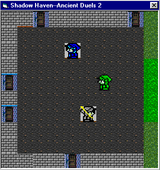

<div align="center">

## A\!\-\-Shadow Haven\-\-A cool RPG in the making\! Features Saving\! Check out screenshot\!\[UPDATED Again\!\]


</div>

### Description

A cool RPG in the making!-Final Fantasy style! Features include: Saving, battle mode, map maker, cool menu, new games, saving positions, and a hell lot more! Check it out! Some of you might have seen my Final Fantasy battle engine that I've submitted a few weeks ago, well I'll be adding that in here! Small download! The new updated version has all the errors wiped out, includes music, and battle mode!

Just like Final Fantasy!
 
### More Info
 


<span>             |<span>
---                |---
**Submitted On**   |2001-07-30 16:31:42
**By**             |[LordsOfGames](https://github.com/Planet-Source-Code/PSCIndex/blob/master/ByAuthor/lordsofgames.md)
**Level**          |Beginner
**User Rating**    |2.8 (39 globes from 14 users)
**Compatibility**  |VB 6\.0
**Category**       |[Games](https://github.com/Planet-Source-Code/PSCIndex/blob/master/ByCategory/games__1-38.md)
**World**          |[Visual Basic](https://github.com/Planet-Source-Code/PSCIndex/blob/master/ByWorld/visual-basic.md)
**Archive File**   |[A\!\-\-Shadow237797302001\.zip](https://github.com/Planet-Source-Code/lordsofgames-a-shadow-haven-a-cool-rpg-in-the-making-features-saving-check-out-screenshot-__1-25541/archive/master.zip)

### API Declarations

```
'Want more hard-knock games?
'Check out my other submissions!
```


